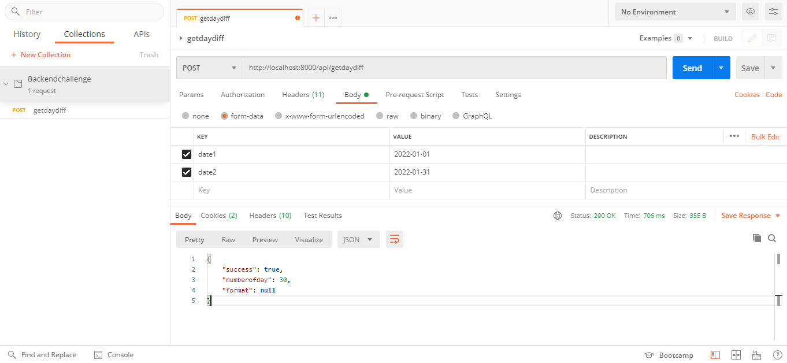
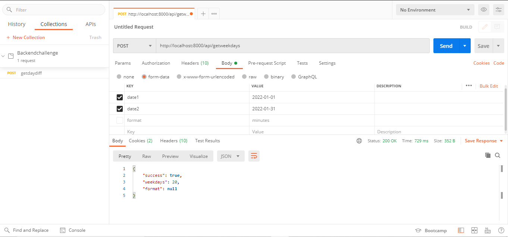
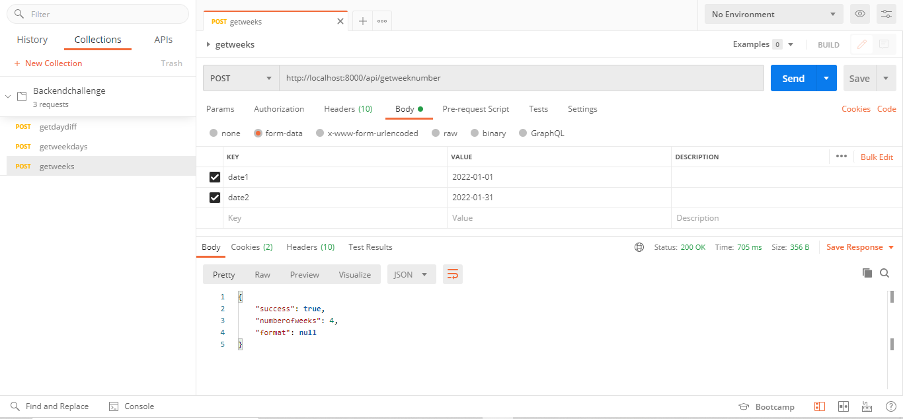
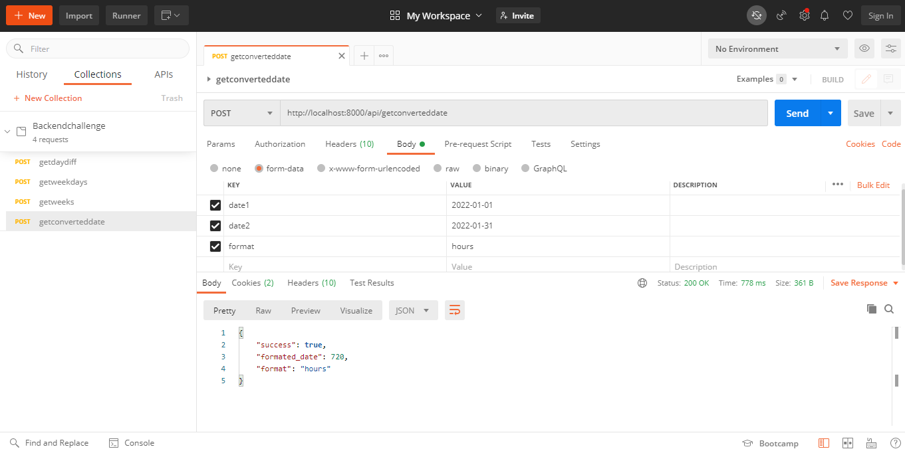
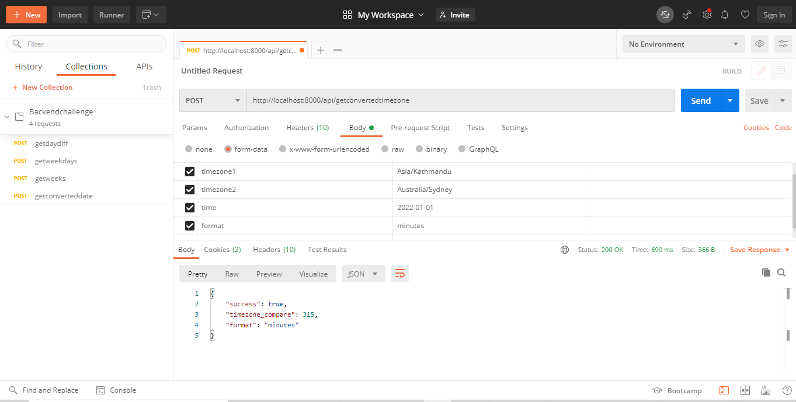

# Backend Challenge
***
The project is done in Laravel ^8.75 Framework and supports PHP 7.3 and PHP 8.

##Requirements for the project
1. [PHP ^7.3](https://www.php.net/)
2. [LAMP or WAMP server](https://ampps.com/)
3. [Composer](https://getcomposer.org/) for downloading the dependency files
4. [Postman](https://www.postman.com/) or any API platform to test the project

***

###Installation
1. Go to your Project Folder
2. Git clone https://github.com/acmtps/backendchallenge.git or you can download the file
3. composer install or composer update
4. Setup configuration in .env files (for this project you can just clone the .env.example file)

***

##How to run and test the project
1. Open a terminal in your project folder and run "PHP artisan serve". This way your project will start at http://127.0.0.1:8000 (you can use http://localhost:8000)
2. Open POSTMAN or any API platform tools to run the APIs.

***

### For every API routes there are parameters like date1, date2, timezone1, timezone2, time and format(seconds, minutes, hours, years)
### In Header include on the API platform:
	Content-Type: multipart/form-data;boundary=<calculated when request is sent>
	Accept: application/json
### Recommended date format Y-m-d

***

2.1. Find out the number of days between two datetime parameters.
		
    http://localhost:8000/api/getdaydiff

***

2.2. Find out the number of weekdays between two datetime parameters.
		
    http://localhost:8000/api/getweekdays

***

2.3. Find out the number of complete weeks between two datetime parameters.
	
    http://localhost:8000/api/getweeknumber
		

***

2.4. Accept a third parameter to convert the result of (1, 2 or 3) into one of
	 seconds, minutes, hours, years.
	
    http://localhost:8000/api/getconverteddate
	 	

***

2.5. Allow the specification of a timezone for comparison of input parameters from
	 different timezones.
	
    http://localhost:8000/api/getconvertedtimezone
	

***

## A postman collection for the APIs is included in the project 
>Backendchallenge.postman_collection.json file

***

## NOTE
Some commands to run incase the project doesnot run properly
1. php artisan config:clear
2. php artisan cache:clear
3. php artisan route:clear
4. composer dump-autoload
